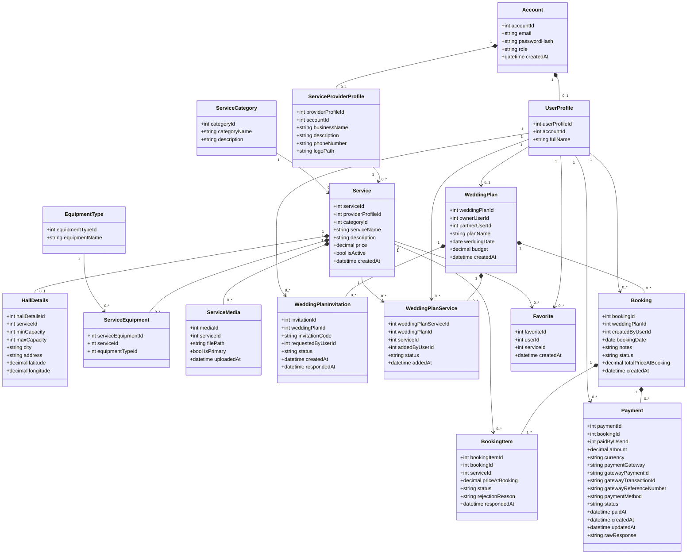

# Class Diagram Design

## Wedding Planning Platform

---

# Overview

This document describes the object-oriented design of the Wedding Planning Platform backend. It defines the main classes, their responsibilities, relationships, and the reasoning behind the architectural decisions.

Unlike the Entity Relationship Diagram (ERD), which represents the database schema, the Class Diagram represents the software structure and interaction between objects inside the application.

The backend follows an object-oriented layered architecture using Python and SQLAlchemy.

---

# Design Goals

The class model was designed to achieve the following goals:

- High maintainability
- Low coupling
- High cohesion
- Easy extensibility
- Clear separation of responsibilities
- Reusable business objects
- Future scalability

---

# Design Principles

The design follows several software engineering principles.

## Layered Architecture

The backend is divided into independent layers.

```text
Client

↓

Routes

↓

Services

↓

Repositories

↓

Models

↓

Database
```

Each layer has a single responsibility.

---

## Single Responsibility Principle (SRP)

Every class has only one responsibility.

Examples:

- Account manages authentication information.
- Booking manages booking information.
- Payment manages payment information.
- WeddingPlan manages planning information.

---

## Composition

Composition is used when one object cannot logically exist without another.

Examples:

- Booking owns BookingItems.
- Booking owns Payments.
- WeddingPlan owns Bookings.
- WeddingPlan owns Selected Services.
- Service owns Media.
- Service owns Hall Details.

If the parent object is removed, its composed objects are also removed.

---

## Association

Association is used when objects collaborate but have independent lifecycles.

Examples:

- UserProfile creates Bookings.
- Provider owns Services.
- Service belongs to Category.
- User saves Favorite services.

---

## Extensibility

The design allows new service categories without changing the core architecture.

Examples:

- Catering
- Wedding Organizer
- Makeup Artist
- Entertainment
- Transportation
- Flower Decoration

These can be introduced by creating new categories while reusing the existing Service model.

---

classDiagram


