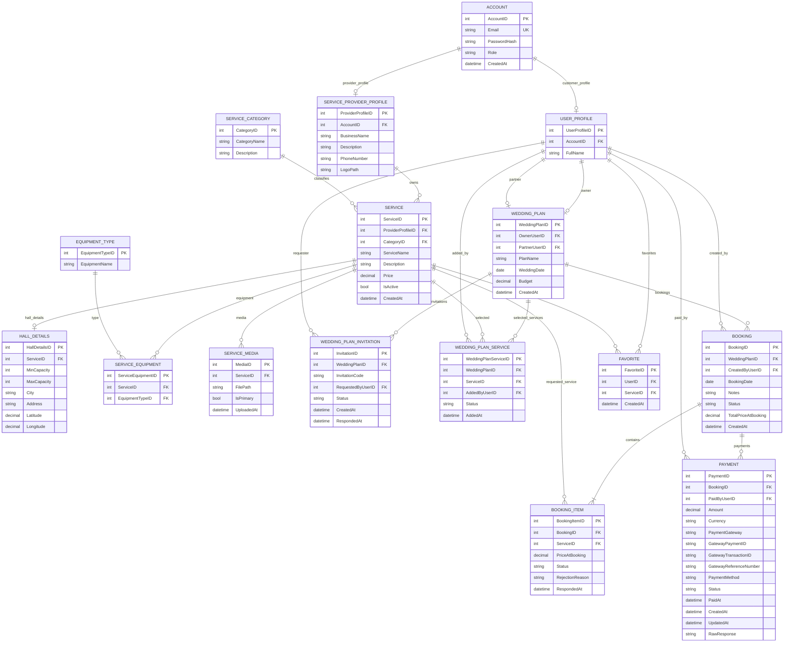

# Database Design

## Wedding Planning Platform

## Overview

This document describes the relational database design of the Wedding Planning Platform. It explains the purpose of each table, its relationships with other tables, and the design decisions behind the database.

The database is designed using a normalized relational model to ensure data consistency, reduce redundancy, and support future scalability.

---

# Database Design Principles

The database was designed according to the following principles:

- Normalize data to reduce duplication.
- Separate business entities into independent tables.
- Use foreign keys to maintain referential integrity.
- Support future expansion by keeping the design modular.
- Store payment gateway responses without storing sensitive payment information.

---

# Entity Relationship Diagram (ERD)

---

# Table Descriptions

## ACCOUNT

Stores authentication information for all users. Every account belongs to exactly one customer profile or one service provider profile.

---

## USER_PROFILE

Stores customer information such as the customer's full name. Customers create wedding plans, bookings, payments, and favorites.

---

## SERVICE_PROVIDER_PROFILE

Stores business information for service providers. Each provider can create and manage multiple services.

---

## SERVICE_CATEGORY

Stores available service categories (Hall, Photographer, Makeup Artist, etc.). This design makes the system extensible without changing the database schema.

---

## SERVICE

Represents a wedding service offered by a provider. Common service information is stored here regardless of service type.

---

## HALL_DETAILS

Stores hall-specific information such as capacity and location. It exists only for services categorized as halls.

---

## EQUIPMENT_TYPE

Stores available photography equipment types.

---

## SERVICE_EQUIPMENT

Implements the many-to-many relationship between photography services and equipment types.

---

## SERVICE_MEDIA

Stores images and media associated with each service. Media files are stored on the server, while the database stores only their paths.

---

## WEDDING_PLAN

Represents the customer's wedding planning workspace, including wedding date, budget, owner, and optional partner.

---

## WEDDING_PLAN_INVITATION

Stores collaboration invitations between partners.

---

## WEDDING_PLAN_SERVICE

Stores all services selected during the planning stage before booking.

---

## BOOKING

Represents a booking transaction created from a wedding plan. A single booking may contain multiple requested services.

---

## BOOKING_ITEM

Represents each requested service inside a booking. Providers can independently accept or reject their booking items.

---

## PAYMENT

Stores payment information and payment gateway responses. Sensitive card information is never stored.

---

## FAVORITE

Allows customers to save services for future reference without affecting bookings or wedding plans.

---

# Database Relationships

- One Account owns one Customer Profile or one Provider Profile.
- One Provider can own multiple Services.
- One Service belongs to one Category.
- One Wedding Plan contains multiple selected services.
- One Booking contains multiple Booking Items.
- One Booking can have multiple Payment records.
- Customers can save multiple Favorite services.

---

# Future Extensions

The current design supports future expansion without major schema changes. New service categories such as catering, flower decoration, entertainment, transportation, or wedding organizers can be added by inserting new records into the `SERVICE_CATEGORY` table while reusing the existing service architecture.
