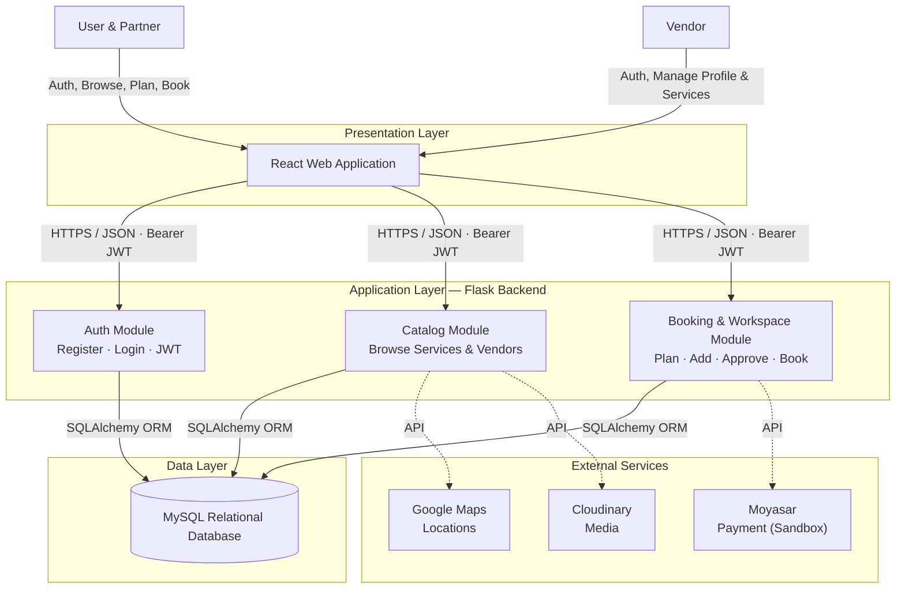

# System Architecture — Farah

High-level architecture showing how the system components interact and how data flows between them.

## Layer Responsibilities

**Presentation Layer (React):** Renders all user and vendor interfaces. Sends authenticated requests to the backend over HTTPS using JWT tokens. Holds no business logic.

**Application Layer (Flask):** Contains all business logic, split into three modules — Auth (registration, login, token handling), Catalog (browsing services and vendors), and Booking & Workspace (wedding plans, shared decisions, bookings). Communicates with the database through SQLAlchemy ORM and calls external services when needed.

**Data Layer (MySQL):** Persists all application data — accounts, services, plans, bookings, and favorites.

**External Services:** Moyasar handles payment in sandbox mode, Google Maps provides venue locations, and Cloudinary hosts and optimizes media files.