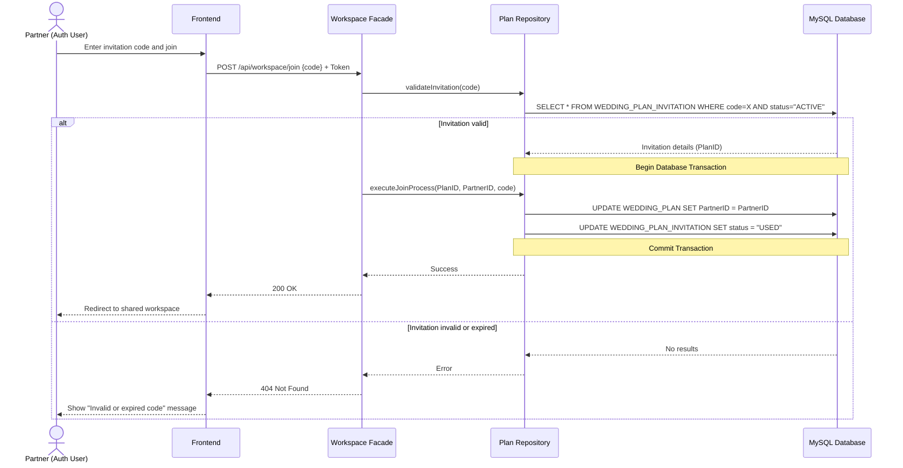
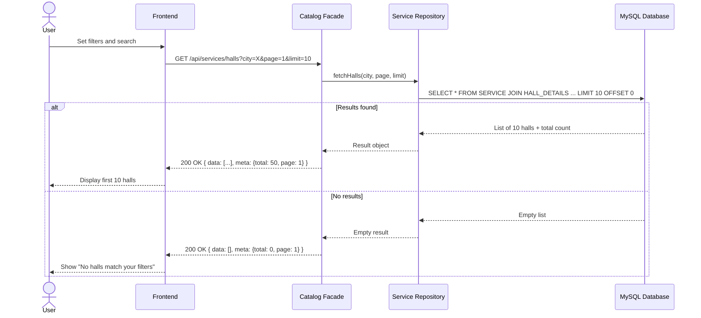
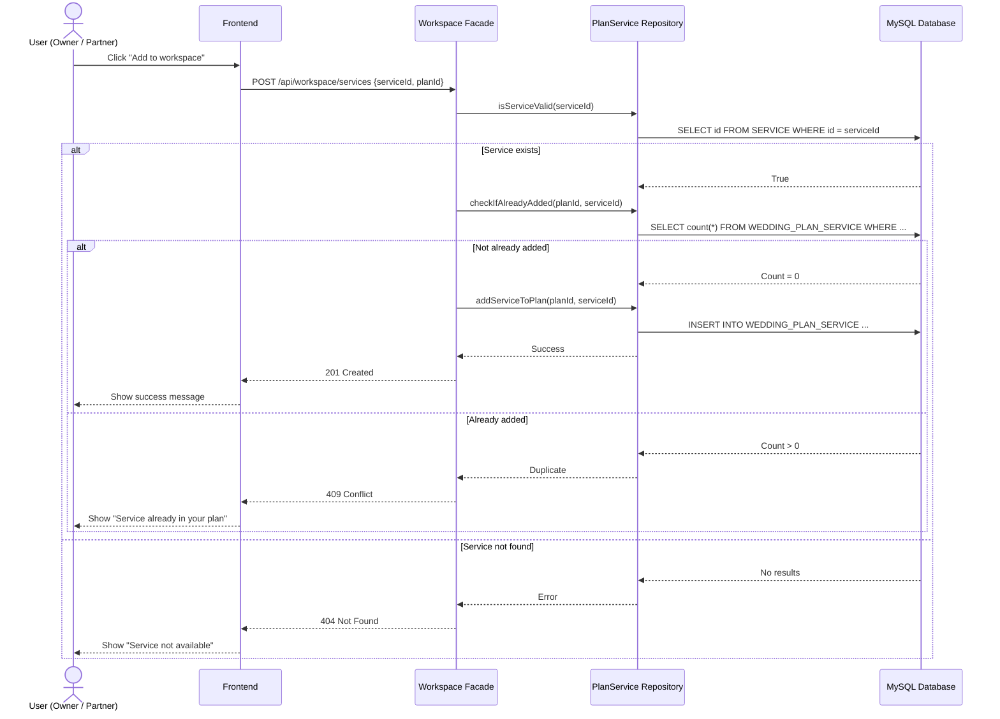
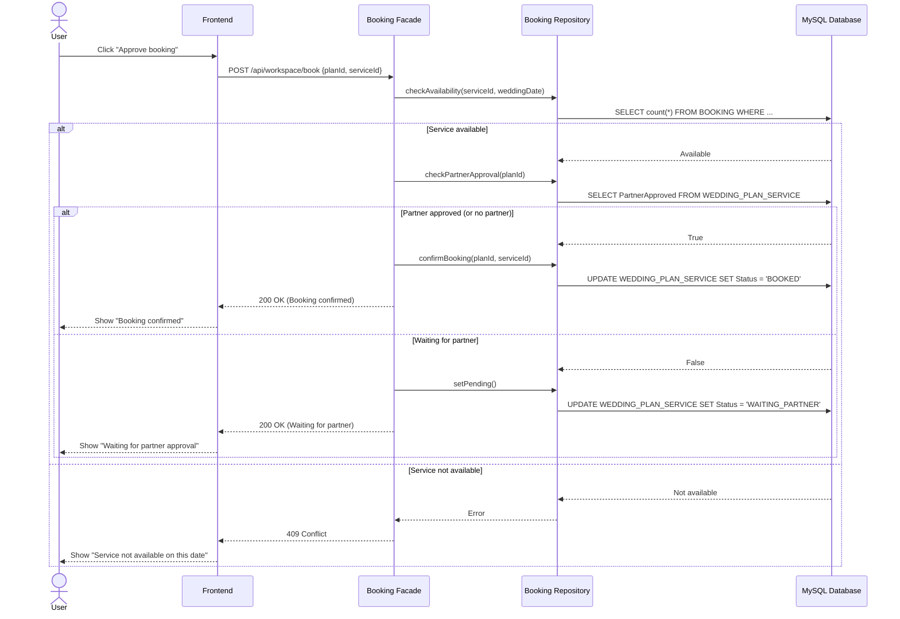

# Sequence Diagrams — Farah

> Four key use cases. Facade + Repository pattern, MySQL database.
> Each diagram shows the success path and the main error path.

---

## Diagram 1 — Partner Joins a Shared Wedding Plan

---

## Diagram 2 — Browse Halls with Filters and Pagination

---

## Diagram 3 — Add a Service to the Workspace

---

## Diagram 4 — Confirm a Booking with Partner Approval

